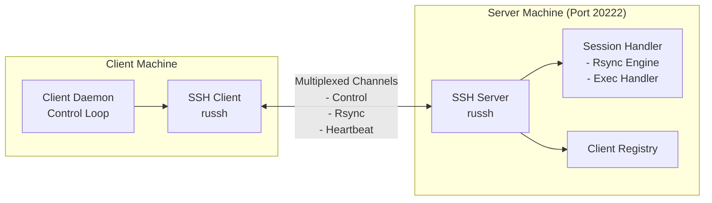

# HalfRemembered Launcher

A secure, persistent SSH-based RPC system for syncing build artifacts and launching binaries across machines. Inspired
by OpenSSH's ControlMaster architecture, it provides server-initiated push capabilities to clients behind NAT/dynamic
IPs while maintaining SSH security.

## 🚀 Self-Deployment Setup

The launcher can build and sync itself to client machines.

**Prerequisites**: SSH agent with keys loaded (`ssh-add -l`), Rust toolchain, and for Windows builds: `mingw-w64-gcc` and `x86_64-pc-windows-gnu` target.

### 1. Build on Your Development Machine

```bash
# Install Linux binary to ~/.cargo/bin
cargo install --path launcher

# Optional: Build for Windows (requires cross-compile toolchain)
rustup target add x86_64-pc-windows-gnu
# Arch: sudo pacman -S mingw-w64-gcc nasm
# Ubuntu: sudo apt install gcc-mingw-w64-x86-64 nasm
./build-windows.sh
```

### 2. Start Server and Connect Clients

```bash
# Terminal 1: Start server on build machine
# The server auto-detects .hrlauncher.toml and configures watches
halfremembered-launcher server

# Get the scp command to run on your client
echo "scp $USER@$(hostname):~/.cargo/bin/halfremembered-launcher ~/.cargo/bin/"

# Terminal 2: On your laptop/client machine, run that scp command, then:
halfremembered-launcher client buildmachine
```

The included `.hrlauncher.toml` is **automatically loaded** when you start the server. The server walks up from the current directory (like git does) to find the config file and configures watches for all sync rules.

> 💡 **New in this version**: No need to run `config-sync` separately! The server auto-configures on startup.

### 3. Build and Auto-Deploy

With the server running and clients connected, any new builds sync automatically to connected clients:

```bash
# Linux build → syncs to all clients
cargo build --release

# Windows build → syncs to all clients
./build-windows.sh
```

Edit `.hrlauncher.toml` to customize sync paths and targets.

## Quick Start

Get up and running in four steps. This guide assumes your SSH agent is running and has keys loaded (`ssh-add -l`).

**1. Build the Project**

First, compile the project in release mode.

```bash
cargo build --release
```

**2. Start the Server**

Open a terminal and run the server. It will listen for clients on the default port (20222).

```bash
./target/release/halfremembered-launcher server
```

**3. Connect a Client**

Open a second terminal in the same directory. Run the client and enable info-level logging to see it connect.

```bash
./target/release/halfremembered-launcher client localhost
```

> **What to Expect**: You should see log messages from the client confirming it has registered with the server, followed by periodic heartbeats. This indicates a successful connection.

**4. Sync a File**

In a third terminal, use the `sync` command to transfer a file to the connected client. Let's sync the `Cargo.toml` file as an example. Note that management commands also need the server address.

```bash
./target/release/halfremembered-launcher sync Cargo.toml --destination /tmp/Cargo.toml --server localhost
```

To verify, you can check the contents of `/tmp/Cargo.toml` on the client machine. You've just synced your first file! For more advanced options, see the **Usage** section below.

## Architecture Overview

The launcher uses persistent SSH connections with multiplexed channels for bidirectional communication:



### Key Features

- **Persistent SSH Connections**: Single authenticated connection per client, multiplexed for all operations
- **Efficient Delta Sync**: Built-in rsync algorithm transfers only changed blocks, minimizing bandwidth
- **Server Push**: Server can initiate file transfers and commands to connected clients
- **NAT/Firewall Friendly**: Clients establish outbound connections only
- **User Context**: Client runs in user environment with full access to graphics, audio, etc.
- **Self-Deploying**: Binary can bootstrap itself to remote machines
- **Cross-Platform**: Works on Linux, WSL, and native Windows
- **No System Services**: Runs entirely in user space, no systemd/Windows services needed

### Communication Flow

1. **Client connects to server** via SSH on port 20222 (outbound connection)
2. **Authenticates** using ssh-agent (no private key handling)
3. **Registers capabilities** and hostname with server
4. **Maintains persistent connection** with heartbeats
5. **Server pushes commands** through control channel using bincode protocol:
   - File sync operations (rsync delta algorithm over dedicated channel)
   - Binary execution requests
   - Status queries
6. **Client multiplexes operations** over single SSH connection
7. **Efficient transfers**: Rsync engine calculates signatures and transfers only changed blocks

### Technical Details

- **Server**: Pure Rust SSH server (`russh`) on port 20222 with ephemeral Ed25519 keys
- **Client**: Pure Rust SSH client (`russh`) with ssh-agent authentication only
- **Wire Protocol**: Length-prefixed bincode (compact binary, ~3x smaller than JSON)
- **File Transfer**: Rsync algorithm (`fast_rsync` crate) for efficient delta synchronization
- **Authorization**: Server reads `~/.ssh/authorized_keys` for authorized keys
- **Configuration**: CLI flags with sensible defaults (everything configurable)
- **Async Runtime**: Tokio for all I/O operations (client and server)

## Installation

### Prerequisites

- Rust 1.85+ (`rustup` recommended)
- SSH agent with at least one key loaded (`ssh-add`)
- Ed25519 key recommended

### Building

```bash
# Linux build
cargo build --release

# Windows cross-compile (from Linux/WSL)
./build-windows.sh
```

## Platform Setup

### Linux

**Setup SSH agent:**
```bash
# Ensure ssh-agent is running
echo $SSH_AUTH_SOCK  # Should show a path
eval $(ssh-agent)    # If not running

# Add your key
ssh-add ~/.ssh/id_ed25519
```

**Run client:**
```bash
# Basic
./target/release/halfremembered-launcher client user@server

```

### Windows

**Setup OpenSSH Agent:**
```powershell
# Enable and start service
Get-Service ssh-agent | Set-Service -StartupType Automatic
Start-Service ssh-agent

# Add key
ssh-add C:\Users\YourName\.ssh\id_ed25519
ssh-add -l  # Verify
```

**Run client:**
```powershell
# Basic
.\halfremembered-launcher.exe client user@server

```

**Alternative**: Use Pageant (PuTTY's agent) - russh auto-detects it.

### Platform Notes

| Feature | Linux | Windows PowerShell | Notes |
|---------|-------|-------------------|-------|
| SSH Agent | `ssh-agent` | OpenSSH Agent service or Pageant | Both fully supported |
| Binary | Native ELF | Static .exe (no DLLs) | Single file deployment |
| File Paths | Unix paths | Windows paths auto-handled | Rust handles conversion |
| Permissions | chmod via Rust API | Not needed on Windows | Conditional compilation |
| Logging | `RUST_LOG=debug ./binary` | `$env:RUST_LOG="debug"` | Different env syntax |
| Networking | Pure Rust (russh) | Pure Rust (russh) | Identical implementation |

### Troubleshooting

**Check SSH agent:**
```bash
ssh-add -l  # List loaded keys (works on both Linux and Windows)
```

**Test connection manually:**
```bash
ssh -p 20222 user@server  # Should work before launcher will
```

**Enable debug logging:**
```bash
# Linux
RUST_LOG=debug ./target/release/halfremembered-launcher client user@server

# Windows PowerShell
$env:RUST_LOG="debug"; .\halfremembered-launcher.exe client user@server
```

## Usage

### Start the Server

Run the server daemon on a publicly accessible machine.

```bash
# Start on the default port (20222)
./target/release/halfremembered-launcher server

# Start on a custom port
./target/release/halfremembered-launcher server --port 1337
```

### Start a Client

The client connects to the server and waits for commands. The `<SERVER>` argument can be a simple hostname or a full `user@host:port` string.

```bash
# Connect to a server on the same machine
./target/release/halfremembered-launcher client localhost

# Connect to a remote server with a specific user
./target/release/halfremembered-launcher client alice@example.com

# Connect to a remote server with a custom port
./target/release/halfremembered-launcher client bob@dev-server.local:1337

# Connect with custom heartbeat and reconnect intervals
./target/release/halfremembered-launcher client server.example.com --heartbeat 60 --reconnect 10
```

### Server Management Commands

Management commands are sent to the server to control clients. The `--server` argument specifies the server to connect to, and defaults to `$USER@localhost` if not provided.

```bash
# List connected clients
./target/release/halfremembered-launcher list --server user@localhost

# Ping a specific client
./target/release/halfremembered-launcher ping laptop01 --server user@localhost

# Execute a command on a client
./target/release/halfremembered-launcher exec laptop01 ./myapp arg1 arg2 --server user@localhost

# Sync a file to all connected clients
./target/release/halfremembered-launcher sync /path/to/local/file --destination /remote/path/file --server user@localhost

# Get server status
./target/release/halfremembered-launcher status --server user@localhost

# Shutdown the server
./target/release/halfremembered-launcher shutdown --server user@localhost
```

### Bootstrap/Deploy

You can use the `push` command to deploy the launcher binary to a new machine.

```bash
# Push binary to a server and start it
./target/release/halfremembered-launcher push user@server \
    --binary ./target/release/halfremembered-launcher \
    --destination ~/halfremembered-launcher \
    --start
```

## Security

- All communication over SSH (encrypted, authenticated)
- SSH agent authentication (no password/key storage)
- No listening ports on client machines
- Server authenticates clients via SSH keys

## About This Project

HalfRemembered Launcher was collaboratively developed by **Amy Tobey**, **Claude Code** (Anthropic's AI coding assistant), and **Gemini** (Google's AI coding assistant). This project demonstrates how human creativity and AI capabilities can combine to scratch an itch. This all could have been a shell script but Amy had agents write most of the code as an experiment in shell script harm reduction and trying some bot-driven OSS.

Agent contributors must read [BOTS.md](BOTS.md).
