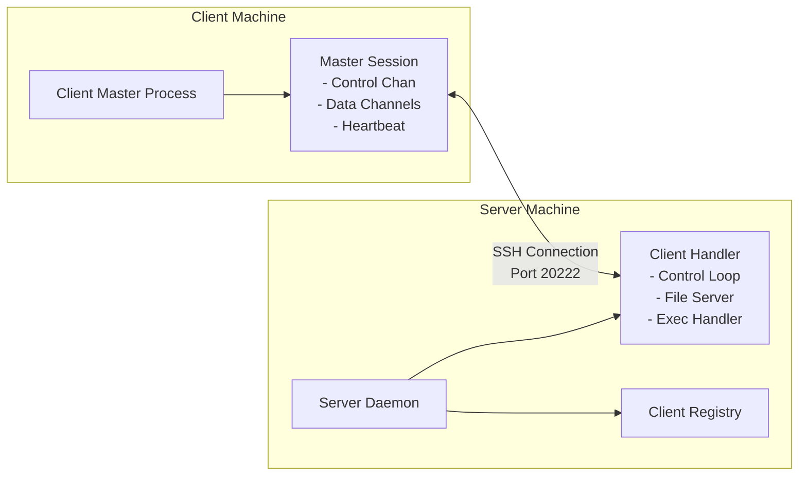

# HalfRemembered Launcher

A secure, persistent SSH-based RPC system for syncing build artifacts and launching binaries across machines. Inspired
by OpenSSH's ControlMaster architecture, it provides server-initiated push capabilities to clients behind NAT/dynamic
IPs while maintaining SSH security.

## Quick Start

Build, start the server, start a client, all on localhost.

```bash
# 1. Build the project
cargo build --release

# 2. Terminal 1: Start the server
./target/release/halfremembered-launcher server --port 20222

# 3. Terminal 2: Start a client (connects to localhost)
RUST_LOG=info ./target/release/halfremembered-launcher client $USER@localhost --port 20222
```

You should see client registration, heartbeats every 30 seconds, and persistent connection maintenance. Press Ctrl+C
to stop.

## Architecture Overview

The launcher uses persistent SSH connections with multiplexed channels for bidirectional communication:



### Key Features

- **Persistent SSH Connections**: Single authenticated connection per client, multiplexed for all operations
- **Server Push**: Server can initiate file transfers and commands to connected clients
- **NAT/Firewall Friendly**: Clients establish outbound connections only
- **User Context**: Client runs in user environment with full access to graphics, audio, etc.
- **Self-Deploying**: Binary can bootstrap itself to remote machines
- **Cross-Platform**: Works on Linux, WSL, and native Windows
- **No System Services**: Runs entirely in user space, no systemd/Windows services needed

### Communication Flow

1. **Client connects to server** via SSH on port 20222 (outbound connection)
2. **Authenticates** using ssh-agent (no private key handling)
3. **Registers capabilities** and hostname with server
4. **Maintains persistent connection** with heartbeats
5. **Server pushes commands** through control channel using bincode protocol:
   - File sync operations (via SFTP)
   - Binary execution requests
   - Status queries
6. **Client multiplexes operations** over single SSH connection

### Technical Details

- **Server**: Pure Rust SSH server (`russh`) on port 20222 with ephemeral Ed25519 keys
- **Client**: Pure Rust SSH client (`russh`) with ssh-agent authentication only
- **Wire Protocol**: Length-prefixed bincode (compact binary, ~3x smaller than JSON)
- **Authorization**: Server reads `~/.ssh/authorized_keys` for authorized keys
- **Configuration**: CLI flags with sensible defaults (everything configurable)
- **Async Runtime**: Tokio for all I/O operations (client and server)

## Installation

### Prerequisites

- Rust 1.70+ (`rustup` recommended)
- SSH agent with at least one key loaded (`ssh-add`)
- Ed25519 key recommended

### Building

```bash
# Linux build
cargo build --release

# Windows cross-compile (from Linux/WSL)
./build-windows.sh
```

## Platform Setup

### Linux

**Setup SSH agent:**
```bash
# Ensure ssh-agent is running
echo $SSH_AUTH_SOCK  # Should show a path
eval $(ssh-agent)    # If not running

# Add your key
ssh-add ~/.ssh/id_ed25519
```

**Run client:**
```bash
# Basic
./target/release/halfremembered-launcher client user@server

# With logging
RUST_LOG=info ./target/release/halfremembered-launcher client user@server
```

### Windows

**Setup OpenSSH Agent:**
```powershell
# Enable and start service
Get-Service ssh-agent | Set-Service -StartupType Automatic
Start-Service ssh-agent

# Add key
ssh-add C:\Users\YourName\.ssh\id_ed25519
ssh-add -l  # Verify
```

**Run client:**
```powershell
# Basic
.\halfremembered-launcher.exe client user@server

# With logging
$env:RUST_LOG="info"; .\halfremembered-launcher.exe client user@server
```

**Alternative**: Use Pageant (PuTTY's agent) - russh auto-detects it.

### Platform Notes

| Feature | Linux | Windows PowerShell | Notes |
|---------|-------|-------------------|-------|
| SSH Agent | `ssh-agent` | OpenSSH Agent service or Pageant | Both fully supported |
| Binary | Native ELF | Static .exe (no DLLs) | Single file deployment |
| File Paths | Unix paths | Windows paths auto-handled | Rust handles conversion |
| Permissions | chmod via Rust API | Not needed on Windows | Conditional compilation |
| Logging | `RUST_LOG=info ./binary` | `$env:RUST_LOG="info"` | Different env syntax |
| Networking | Pure Rust (russh) | Pure Rust (russh) | Identical implementation |

### Troubleshooting

**Check SSH agent:**
```bash
ssh-add -l  # List loaded keys (works on both Linux and Windows)
```

**Test connection manually:**
```bash
ssh -p 20222 user@server  # Should work before launcher will
```

**Enable debug logging:**
```bash
# Linux
RUST_LOG=debug ./target/release/halfremembered-launcher client user@server

# Windows PowerShell
$env:RUST_LOG="debug"; .\halfremembered-launcher.exe client user@server
```

## Usage

### Start the Server

```bash
# Start server daemon on port 20222
halfremembered-launcher server --port 20222
```

### Start a Client

```bash
# Connect to server (client daemon maintains persistent connection)
halfremembered-launcher client user@buildserver --port 20222

# With custom heartbeat and reconnect intervals
halfremembered-launcher client user@buildserver \
    --heartbeat 30 \
    --reconnect 5
```

### Server Management Commands

```bash
# List connected clients
halfremembered-launcher list --server user@localhost --port 20222

# Ping a specific client
halfremembered-launcher ping laptop01 --server user@localhost --port 20222

# Execute command on a client
halfremembered-launcher exec laptop01 ./myapp arg1 arg2 \
    --server user@localhost --port 20222

# Sync a file to all connected clients
halfremembered-launcher sync /path/to/local/file \
    --destination /remote/path/file \
    --server user@localhost --port 20222

# Get server status
halfremembered-launcher status --server user@localhost --port 20222

# Shutdown the server
halfremembered-launcher shutdown --server user@localhost --port 20222
```

### Bootstrap/Deploy

```bash
# Push binary to server and optionally start it
halfremembered-launcher push user@server \
    --binary ./target/release/halfremembered-launcher \
    --destination ~/halfremembered-launcher \
    --start \
    --port 20222
```

## Security

- All communication over SSH (encrypted, authenticated)
- SSH agent authentication (no password/key storage)
- No listening ports on client machines
- Server authenticates clients via SSH keys

## About This Project

HalfRemembered Launcher was collaboratively developed by **Amy Tobey** and **Claude Code** (Anthropic's AI coding
assistant). This project demonstrates how human creativity and AI capabilities can combine to build sophisticated
systems that solve real-world problems.

For developers interested in the architecture, implementation details, and contributing guidelines, see
[BOTS.md](BOTS.md).
